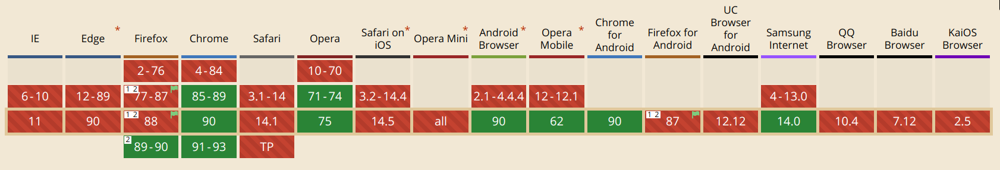
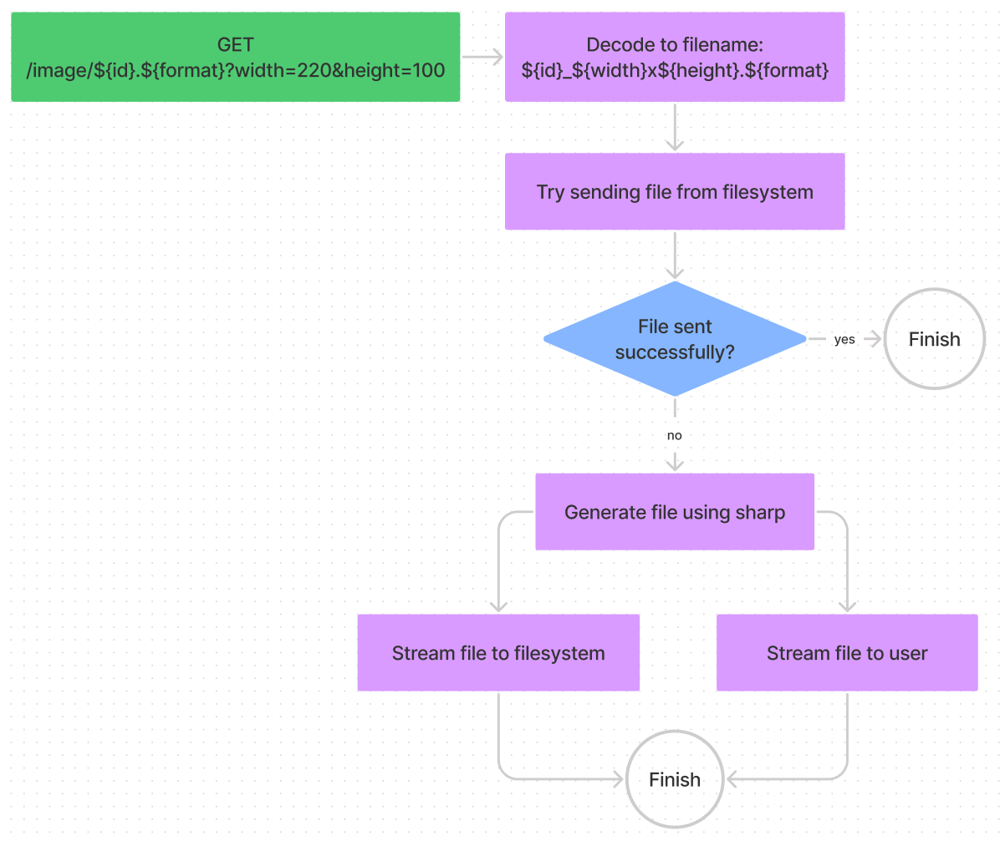
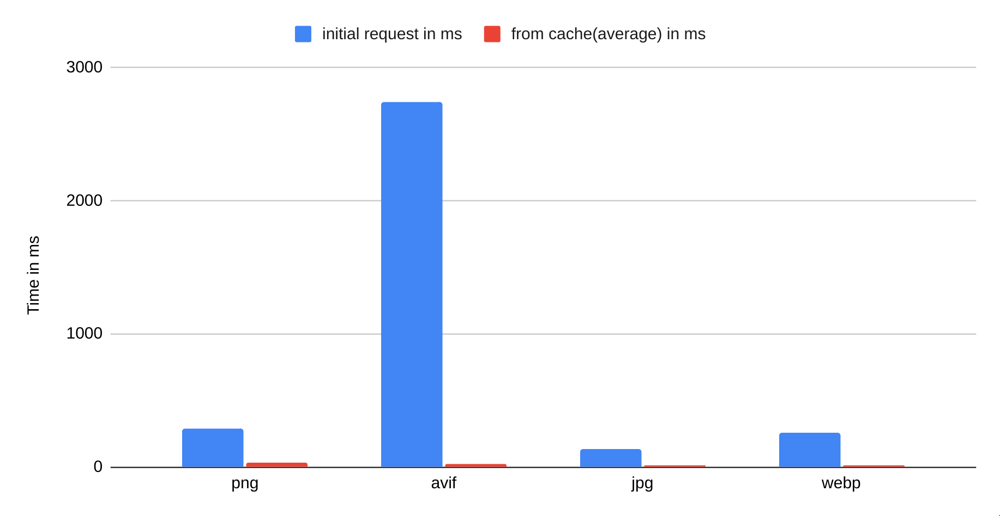

Images are an integral part of todays web landscape. But a lot of sites aren't using the capabilities of modern browsers to their full extent. Using modern techniques, like the native `<picture> `Element, you can let the users browser do all the hard work of determining the optimal format and size for an image, but only if you are able to supply the multitude of required formats.

This is not an easy task, but a rewarding one. By now we are all aware of the importance of optimizing the mobile experience, but images are still often overlooked and can be hard to optimize. Different browsers support different image formats (AVIF images are still not supported everywhere), customers may use older or less expensive devices with differing DPI ratios and screen sizes, and some users may access your site using their home network and some using their slow mobile data on the subway.

<figure class="wide">



<figcaption>AVIF support, 05.2021</figcaption>
</figure>


For all those scenario, there is an optimal image format. And because images are, at least for a lot, if not most, sites, the biggest traffic source, this area benefits a lot from optimization.

But how can we achieve this and create a better browsing experience, and thus conversion rates / whatever metric you are optimizing?

This article tries to showcase modern techniques for achieving an optimal image experience and highlight some pitfalls you might encounter while developing a solution for these problems.

## Uploading an image

The first step for a better image experience begins with image upload. 

For this post I've setup a simple Express server connected to a Mongo database, but you are free to use whatever type of database you want.

The upload part is handled by [Multer](https://github.com/expressjs/multer#readme). This an image upload middleware for Express that handles the upload of the raw image by the user. After the initial upload we also generate an LQUIP(low quality image placeholder) using [sharp](https://sharp.pixelplumbing.com/) (we will also use this later to generate different image sizes and formats). We use this low resolution preview of the image to reduce the perceived loading time of the image. We can store this low resolution version directly in our database because it is extremely tiny. This way we can also send it along the first request when a user requests, for example, a post.

We will split the logic into two files, `imagesService.js` and `images.js`, to make the code a little more readable.

First, we generate the middleware for uploading a file that can later be used in a route in `images.js`:

<div class="wider">

```js
// src/routes/images/imagesService.js
export const uploadMiddleware = multer({
  limits: {
    // limit filesize to 5MB, you can change this if your
    // applications needs larger images
    fileSize: 5 * 1024 * 1024
  },
  // configure multer to save incoming files to disk
  storage: multer.diskStorage({
    destination: (req, file, cb) => {
      // configure multer to store images in '/public/img'
      cb(null, path.join(process.cwd(), '/public/img'))
    },
    filename: (req, file, cb) => {
      // We use a MongoDb ObjectId as the filename to link
      // it more easily to our database
      const name = new mongoose.Types.ObjectId();
      file.originalname = name;
      cb(null, `${name}`)
    }
  }),
  filter: (req, file, cb) => {
    // in this example I restrict uploaded images to png and
    // jpeg for simplicity, you can change this if you want
    if (
      file.mimetype === 'image/png' ||
      file.mimetype === 'image/jpeg'
    ) {
      cb(null, true);
    } else {
      cb(new Error('Not an image! Please upload an image.'), false);
    }
  }
}).single('image')
```

</div>


We **limit the maximum file size** to prevent abuse, you can raise the limit if your application can handle the increased size.

We also save incoming files directly to disk. This way we can keep our memory consumption low, as the file gets saved to disk while the transfer is going on, so there is no point at which the whole file is loaded in memory.

For the filename we use a MongoDB ObjectId. This makes it easy for us to use it as a primary key in our database. Depending on your application, this could actually pose a security risk as ObjectIDs are potentially guessable[^1]. You could change this to use any kind of random string generation you like.

### Upload logic

<div class="wider">

```js
// src/routes/images/imagesService.js

export async function createImage(image, user) {
  if(!image)
    throw new Error("No image provided");

  // generate LQIP for given image, with a maximum
  // of 20px in either width or height
  const lqipData = await sharp(image.path)
    .resize(20, 20, {
      fit: sharp.fit.inside,
      withoutEnlargement: true
    })
    .toBuffer()

  // create a new entry in the database for the uploaded file 
  let imageDbEntry = new Image({
    _id: new mongoose.Types.ObjectId(image.originalname),
    _user: new mongoose.Types.ObjectId(user._id),
    format: image.mimetype.split('/')[1],
    lqip: `data:image/png;base64,${lqipData.toString('base64')}`
  });
  imageDbEntry.save();
  
  return {
    id: imageDbEntry._id,
    url: config.backendUrl + '/img/' + image.filename,
    lqip: imageDbEntry.lqip
  }
}
```

</div>

Next, we provide a function for saving a reference to our image in the database. During this, we also create the LQUIP for the image using sharp and save it as base64 so we can use it directly in a `src` attribute on our frontend.

### Upload route

Now we just need to access `createImage` and uploadMiddleware in our route. I've also used a middleware called `isAuthenticated`, here you would need to insert your own authentication checks. 

<div class="wider">

```js
// src/routes/images/images.js

router.post('/', 
  isAuthenticated,
  uploadMiddleware,
  async (req, res) => {
    try {
      const newImage = await createImage(req.file, req.user);
      res.json(newImage);
    } catch(e) {
      console.log(e)
      return res.status(400).json({error: e.message})
    }
  }
)
```

</div>


## Requesting an image

We could generate a new image on every request, but doing so would be inefficient and slow, especially if the same image is going to be served to a lot of people, like the header of a post.

Also, when we need to generate a new image, we dont't store the new image in memory as a whole, and instead **stream** it to a new file and to the user. This way we can keep memory usage low and serve a lot more images at the same time.

We will implement the following logic to speed up image requests:

<div class="wide">



</div>

Now we just need to write our express route. I will explain the single pieces afterwards.

<div class="wide">


```js
// src/routes/images/images.js

router.get('/:image',
  (req, res) => {
    const requestedFileRegex = /^([A-Za-z0-9_-]{24})(\.)(png|jpg|webp|avif)$/i;
    const filteredFileReq = requestedFileRegex.exec(req.params.image);
    log('request for image: ' + req.params.image);

    // check if file request is in correct format
    if(!filteredFileReq) 
      return res.sendStatus(400);
    
    // get file metadata
    const id      = filteredFileReq[1];
    const format  = filteredFileReq[3];
    let width   = parseInt(req.query.width);
    let height  = parseInt(req.query.height);

    // check if width and height have correct format
    if(!width || !height)
      return res.sendStatus(400);

    const filename = `${id}_${width}x${height}.${format}`;
    const sendFileOptions = {
      maxAge: '1y',
      root: path.join(process.cwd(), 'public/img'),
      lastModified: false,
      dotfiles: 'deny',
    }

    // try sending cached image
    res.sendFile(filename, sendFileOptions, (err) => {
      // if sending didn't succeed, try generating image
      if(err) {
        log('image not found, generating...')
        
        // generate resized image
        const sharpOutput = sharp(path.join(process.cwd(), 'public/img/', id))
          .resize(width, height)
          .toFormat(format)

        // set content and caching headers
        res.set('Content-Type', `image/${format === 'jpg'? 'jpg' : format}`);
        res.set('Cache-Control', 'public, max-age=31536000');

        const outputPath = path.join(process.cwd(), 'public/img', filename);

        // catch error, should only be 404
        sharpOutput.on('error', e => {
          log(e);
          // delete temporary file
          fs.unlinkSync(outputPath);
          return res.sendStatus(404);
        });

        // stream output to user
        sharpOutput.pipe(res)

        // stream output to file
        let fileOutStream = fs.createWriteStream(outputPath)
        sharpOutput.pipe(fileOutStream);
      } else {
        log('successfully sent image')
      }
    });
  }
)
```

</div>


### Validating user input

Exposing the local file system, especially when we access it based on user input, can quickly become an easy way for an **attacker to get access** to our server. Thus, we need to be very careful with accepting user input. NodeJS offers some [documentation](https://nodejs.org/en/knowledge/file-system/security/introduction/) on how to secure file system access, and we will use some of the techniques mentioned, alongside the protections express offers us.

The first and probably most important validation we perform is whitelisting the requested file name using the following Regex: `/^([A-Za-z0-9_-]{24})(\.)(png|jpg|webp|avif)$/i`. With this we validate that the file name follows our naming scheme and does not contain escaping characters like "/". We also restrict the formats the client can request from our server.

Then we check if the width and height are both integers. Here you could also restrict the maximum width and height of images if you want.

Next, we generate the filename based on our input with the format `${id}_${width}x${height}.${format}`.

### Try sending the file

We also set configuration options for the `express.sendFile` function. This way we can restrict file access further by specifying a root path, and denying dotfiles entirely. With the setting `maxAge` we are telling express to set a Cache-Control header, so the images gets cached on the users browser.

Then we try sending the file. If the file exists. everything is fine and the request is finished.

### Generating a new image

If the image does not exist, we need to generate it using sharp.

In case an error occurs, e.g. the image is not available, we also need to catch it and send back an error. We also need to delete all references to temporary files that might have been created by using `fs.unlinkSync`. 

Sharp has the ability to stream the newly generated image. As already mentioned, we use this to keep memory usage low and **immediately start sending the image** to the user, even if the resize has not done yet, saving a lot of time.

We create a new file and stream its output to disk, but also to the user. But because express doesn't what kind of data we are sending, we have to set the `Content-Type` and `Cache-Control` headers manually.

If all worked well, the user should now have the new generated image, and any subsequent requests to the same file should be nearly instantaneous, because we **cache** the generated image as a file. 

## Wrapping up

Caching proved to be highly effective. I made benchmarked requests for all image formats and the results speak for themselves:

<div class="wide">



</div>

Now your users should be able to upload images and your frontend can request them in any way needed. Using this you should be able to implement all modern image loading techniques.

The frontend part will be covered in **part two** (coming soon) of this series.

[^1]: https://stackoverflow.com/questions/11577450/are-mongodb-ids-guessable