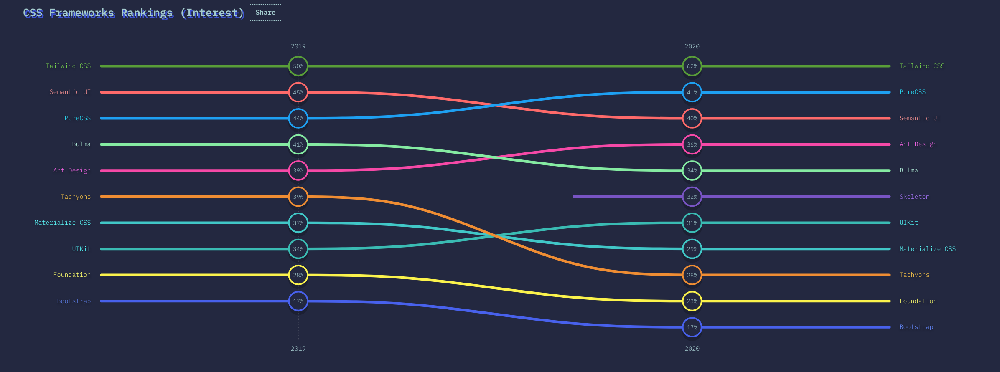
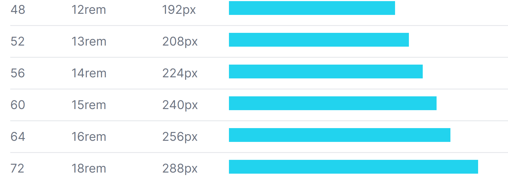

Der Hype um Tailwind CSS ist gerade groß, laut State of CSS[^1] war es 2020 sogar das CSS-Framework mit dem größten Entwicklerinteresse:



Da ich als Semesterprojekt für mein Web Engineering Modul eine Website erstellen musste, und sowieso schon lönger ein Projekt plane, bei dem ein Kanban-Board verwendet werden sollte, habe ich versucht, ein paar der besten Ideen aus Tailwind zu verwenden, und diese mit einem "klassischen" CSS-Kontext zu vereinbaren.

Meiner Meinung nach kann Tailwind bestimmt in einigen Situationen nützlich sein, allerdings erscheint es mir, für ein Projekt mit einem einzigen Entwickler mit viel CSS-Erfahrung, als ziemlicher overkill. Die etlichen CSS-Klassen auswendiglernen und dazu noch Compiler dafür aufsetzen, ist bei kleinen Projekten einfach unnötig komplex. 

## Vorderfinierte Größen, Farben und Abstände

Eine der Besten Ideen, die Tailwind direkt aus der Designwelt übernommen hat, ist die Verwendung von vordefinierten Größen, Farben und Abständen.

Kein Wunder, im Buch Refactoring UI[^2], geschrieben von einem der Entwickler von Tailwind CSS, gibt es ein ganzes Kapitel über "Establish a spacing and sizing system" und ein weiteres mit dem Titel "Define your shades up front". Nützlich ist dabei, dass nicht jede Größe als Wert existiert, sondern eine exponentielle Skala verwendet wird.



In Tailwind CSS wird dies durch eigene Klassen umgesetzt. Eine Höhe von 12 und Breite von 12 der oben zu sehenden Einheiten wird z.B. so beschrieben: ` class="h-12 w-12"`. Jap. Ziemlich umständlich wenn man das für jedes Element setzen muss. Allerdings bietet Tailwind einen kleinen Auswegen aus dem Klassenchaos: @apply. 

Mit @apply werden alle Eigenschaften der gewählten Klassen in einer Oberklasse zusammengefügt. Das sieht dann so aus:

```css
/* Input */
.btn {
  @apply py-2 p-4;
}

/* Output */
.btn {
  padding: 1rem;
  padding-top: 0.5rem;
  padding-bottom: 0.5rem;
}
```

Allerdings wird dafür ein Preprocessor wie z.B. Webpack, etc. benötigt. Doch die Idee ist eigentlich gut: man spart sich Zeit, da man sich nicht bei jedem Abstand Gedanken machen muss, ob man jetzt 12,2px oder 12,3px verwenden soll, und ganz nebenbei sorgt es auch dafür, dass das gesamte Design Einheitlicher wird.

Den selben Effekt kann man aber auch unfassbar einfach in regulärem CSS erzielen, und zwar mit **CSS Variablen**[^3]; Anstatt für jede Größe eine eigene Klasse zu erstellen, können wir für jeden Abstand einfach eine eigene Variable erzeugen. Diese legt man im :root-Element an, um von überall aus im Dokument darauf zugreifen zu können. Das könnte für größen dann z.B. so aussehen

```css
:root {
  --s0_5: 0.125rem;
  --s1: 0.25rem;
  --s2: 0.5rem;
  --s3: 0.75rem;
  --s4: 1rem;
  /* ... */
}
```

Diese kann man dann in einzelnen Klassen wie folgt verwenden:

```css
.btn {
  padding: var(--s2) var(--s4);
}
```

## Zusammenfassung & Erfahrung


Genau diese Strategie habe ich in meinem Web Engineering Projekt, [todo.](todo.malts.me) getestet, und sehr gute Erfahrungen gemacht. Die vordefinierten Größen und Farben machen die Entwicklung deutlich angenehmer und vereinfachten mir in vielen Fällen den Designprozess.

Mit global definierten Farben konnte ich zum Beispiel unfassbar einfach dafür sorgen, dass alle Schatten den selben Blauton verwenden, obwohl sie verschieden größen haben, oder dass das Rot für Formularfehler überall einheitlich ist.

Variablen in CSS sind schon seit Ewigkeiten durch Preprocessoren wie Sass, Less, etc. verfügbar, aber der Tailwindansatz, für jeden mögliche Abstand und Farbe Variablen zu verwenden, ist definitiv etwas, das noch lange in der Frontendentwicklung verwendet werden wird. Den Ansatz mit CSS-Variablen kann ich nur empfehlen, da dadurch auch post-Kompilierungsänderungen wie z.B. ein Darkmode durch das neu-Setzen der Variablen in eine Media Query keine Probleme mehr bereitet. 

<!-- Für das Modul "Web Engineering" mussten wir eine "eigene Webpräsenz" gestalten, welche mindestens ein Formular verwendet, um neue DOM-Elemente zu erzeugen. Da mir schon seit einiger Zeit im Vorschwebt, eine Projekt zu starten, bei dem ich ein Kanbanboard verwenden will, habe ich mir vorgenommen, das Layout dafür in diesem Projekt zu testen. 


Einer der großen Trends im Webdesign ist gerade TailwindCSS[^1]. Obwohl Tailwind sich interessant anhört, und man es eigentlich ausprobieren sollte, bevor man es verurteilt, gefällt mir der Ansatz einfach nicht.

>Was mir an Tailwind aber grundsätzlich gefällt, ist die Idee, Standartgrößen, -Schriftarten und -Farben zu verwenden.

Statt jedes Mal font-size: 2rem oder padding: 12px schreiben zu müssen, legt man am Anfang die Größen, Abstände und Schriftarten fest, und kann diese im gesamten Projekt wiederverwenden. Das führt, jedenfalls bei mir, dazu, dass ich schneller arbeiten kann, da ich mich nicht jedes mal neu entscheiden muss, ob ich den Abstand 1.1rem oder 1.2rem-groß mache. Außerdem führt dies auch zu einem stimmigeren Design, da z.B. Abstände regelmäßíg und konsistent sind.

Tailwind löst dieses Problem mit eigenen Klassen. Um den selben Ansatz mit "normalem" CSS verwenden zu können, benutze ich CSS-Variablen[^2]. Die Größen, Schriftarten und Farben werden dann für das :root-Element gesetzt, und können dadurch überall verwendet werden:

```css
:root {
  --col-dark: #f2f4fa;
  --col-border: #ececf2;
  --col-shadow: #06358112;

  --s0_5: 0.125rem;
  --s1: 0.25rem;
  --s2: 0.5rem;
  --s3: 0.75rem;

  /* ... */
}
```

Das Zweite, das ich von Tailwind geklaut habe, ist das Design. Zu Tailwind gehört auch das großartige Tailwind UI[^3].

Vor einiger Zeit habe ich auch das großartige Buch "Refactoring UI" gekauft und gelesen, in dem mir 


[^1]: [Google Trends](https://trends.google.com/trends/explore?date=today%205-y&q=tailwind%20css)
[^2]: [MDN Link](https://developer.mozilla.org/en-US/docs/Web/CSS/Using_CSS_custom_properties)
[^3]: [Tailwind UI](https://tailwindui.com) -->

[^1]: [State of CSS 2020 Report](https://2020.stateofcss.com/en-US/report/)
[^2]: [Refactoring UI Buch](https://refactoringui.com/book/)
[^3]: [MDN Link](https://developer.mozilla.org/en-US/docs/Web/CSS/Using_CSS_custom_properties)