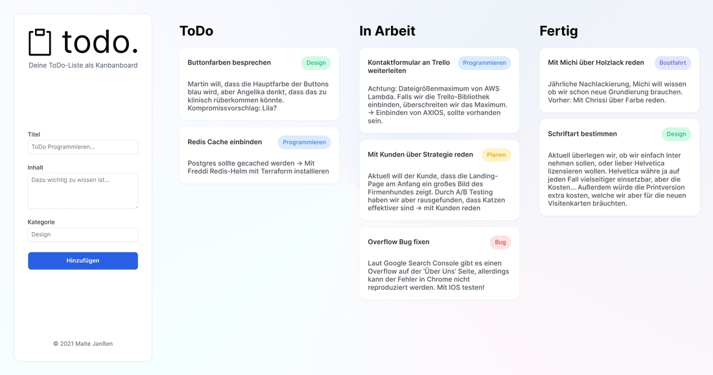

Für das Modul "Web Engineering" mussten wir eine "eigene Webpräsenz" gestalten, welche mindestens ein Formular verwendet, um neue DOM-Elemente zu erzeugen. Da mir schon seit einiger Zeit im Vorschwebt, eine Projekt zu starten, bei dem ich ein Kanbanboard verwenden will, habe ich mir vorgenommen, das Layout dafür in diesem Projekt zu testen. 

