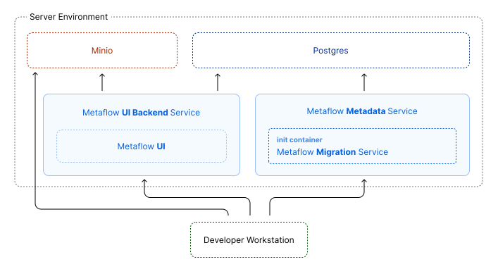
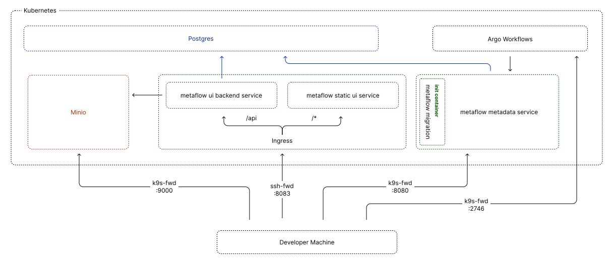
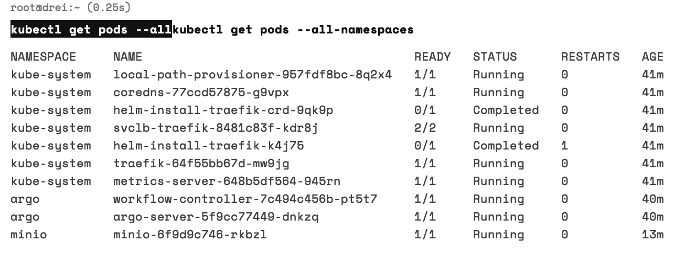

Metaflow is an incredibly nice tool for running python jobs for machine learning or data science on a kubernetes cluster or as a scheduled job on Argo Workflows. It was built at Netflix for tracking various experiments and is offered as a service on a platform called "Outerbounds".

In a recent project of mine, there were three big features of Metaflow that were very attractive:

1. **Running scheduled jobs**\
  This uses Argo Workflows, which is a Kubernetes native workflow orchestrator.
1. **Declaring workflows in python**\
  Using the Metaflow python library, you can write your workflow definitions, including timed scheduling and resource requests right in python. 
2. **Pinning dependency version**\
  Having a lot of data scientists create python files and throwing them in a repo makes running them in production difficult, because you don't know what dependencies they have. Metaflow allows annotating dependencies right in the python file.

In this project, running Metaflow on a cloud provider or using Outerbounds was not possible due to regulatory constraints. 

Unfortunately, the documentation doesn't cover this use case at all, so I had to figure it out on my own. This posts is supposed to fill the gap and help others who want to run Metaflow in their own on-premises or non-cloud environment. 

# Overview

<!-- **Image of metaflow + kubernetes** ? -->

To run metaflow on K3s, it makes sense to understand the components of metaflow first, as it's comprised of multiple services. They are spread across two repos; The main services are in the [netflix/metaflow-service](https://github.com/Netflix/metaflow-service/) repo and the static ui files are found in [netflix/metaflow-ui](https://github.com/Netflix/metaflow-ui). There is also the [metaflow](https://github.com/Netflix/metaflow) python library that runs on your local dev machine, and it does a lot of the heavy lifting in terms of generating workflow templates and kubernetes manifests.

<figure class="wider">

<figcaption>How the different Metaflow services work together</figcaption>
</figure>

- **Metaflow Metadata Service** Offers an API for tracking metadata around workflow runs like the run name and run steps, but not data emitted by a run.
- **Metaflow UI** Static React app that displays runs. Fetches data from the UI Backend Service over Websockets, and *not* from the Metadata Service.
- **Metaflow UI Backend Service** Provides the static frontend with data and accesses a database shared with the metadata service and does not communicate with the metadata service directly. Can optionally be configured to serve the static UI files as well. Also forwards files from MinIO to the frontend.
- **Metaflow Migration Service** Runs migrations for the Metadata Service. Is usually run once before starting the Metadata Service, e.g. as an init container in kubernetes.

Additionally, Metaflow requires a **Postgres database** for storing metadata and an object store for storing data, code and logs for the workflow runs. The object store expects S3, Google Cloud Storage or Azure Blob Storage, but for running everything on-premises, **MinIO** can be used as an S3-compatible object store.

# Kubernetes

Metaflow doesn't need to run on Kubernetes or even access it in any way. However, Kubernetes is needed for running Argo Workflows, and if we need a cluster for that we might as well use it for Metaflow as well (especially because there is a working Helm chart we can use). The way Metaflow triggers workflow runs is by submitting yaml files to the cluster, either with a pod defition or an Argo Workflows CRD (Custom Resource Definition). The yaml files get generated on the developer machine, which needs direct access to the cluster control plane in order to apply them. The code is uploaded to the object store and the workflow pod pulls the code and configuration from there. The workflow pods then submit metadata to the metadata service during and after the run and upload logs and output to the object store again.

The following diagram describes the architecture of the whole cluster, as well as the ways the developer machine might access them. This setup and especially the access from developer machines fits my setup well and expects an **airgapped server environment**. The server needs to be inaccessible from the internet and is either in a private subnet or behind a firewall, otherwise this might pose a **huge security risk**, as we will skip a lot of authentication to make the deployment easier to handle.

<figure class="widest">

<figcaption>Kubernetes Architecture Diagram</figcaption>
</figure>

The easiest way I found to spin up a cluster is using [K3s](https://k3s.io/). It's a lightweight Kubernetes distribution that is easy to install and doesn't require a lot of resources. It's also very easy to install on a single node.

# Setup

First, you need a VM with SSH access. For this you can either use your on-premise infrastructure, or, like I did for testing this, a VPS service like Hetzner (if you want, you can use my [referral link](https://github.com/vitobotta/hetzner-k3s) to get 20€ free credit). If you use a VPS service, remember to set up a firewall to only allow SSH access and kubernetes control plane access from your IP address (port 22 and 6443).

<!-- @TODO, insert correct script link -->

Then, you need to install K3s, Argo Workflows and MinIO. For installing everything at once, I created a script in the accompanying [GitHub repository](https://github.com/malte-j/metaflow-on-k3s) which will hopefully handle everything for you. Just download the repo on the VPS. **Before** running the script, replace the MINIO_ROOT_USER and MINIO_ROOT_PASSWORD in `minio.yaml` with your own base-64 encoded credentials. 

The Argo Workflows install is based on the [quickstart guide](https://github.com/argoproj/argo-workflows/blob/master/docs/quick-start.md) and **disables authentication** for access to it. The MinIO install is loosely based on the [metaflow-with-airflow-minio](https://github.com/outerbounds/metaflow-with-airflow-minio/tree/master) repository, which proved to be helpful in figuring all of this out.

You should now see the services and pods running in the cluster.

For the final step of the setup you will need access to the cluster from you local workstation. Look at the [K3s guide](https://docs.k3s.io/cluster-access#accessing-the-cluster-from-outside-with-kubectl) for details on how to do this.

To create bucket for metaflow, establish a tunnel on your workstation to Minio using `kubectl port-forward svc/minio-service 9000:9000 -n minio`. Next will need to setup metaflow on the workstation, so I recommend installing it in a virtual environment. I copied a python script for creating buckets from the metaflow-with-airflow-minio repository. Run it using `python3 create_bucket.py --access-key miniouser --secret-key miniopassword --bucket-name metaflow-test`. Again, replace the secret and access key with your own.

# Metaflow

Now you can actually start with installing Metaflow. By now you should have a local setup and can access you cluster from your workstation. To install Metaflow, I used the [Helm Chart](https://github.com/outerbounds/metaflow-tools/tree/master/k8s/helm/metaflow) provided by Outerbounds. [Install Helm](https://helm.sh/docs/intro/install/) on your workstation for this. Metaflow will need to access Minio, so change credentials in `install-metaflow.sh` before running it on your workstation.

# F.A.Q.

    
Q: I really don't want to use Kubernetes, can I run Metaflow without it?

A: Yes! You only really need kubernetes if you want to use it to run your workflows in a cluster, or if you want to use Argo Workflows for CRON-like scheduling of jobs. If you don't need this, you can use Apache Airflow as the workflow orchestrator and <a href="https://docs.metaflow.org/production/scheduling-metaflow-flows/scheduling-with-airflow">connect</a> this to the metaflow services, which don't need to run in Kubernetes. You miss some features of Argo Workflows, but the operational complexity might be worth it for you.

