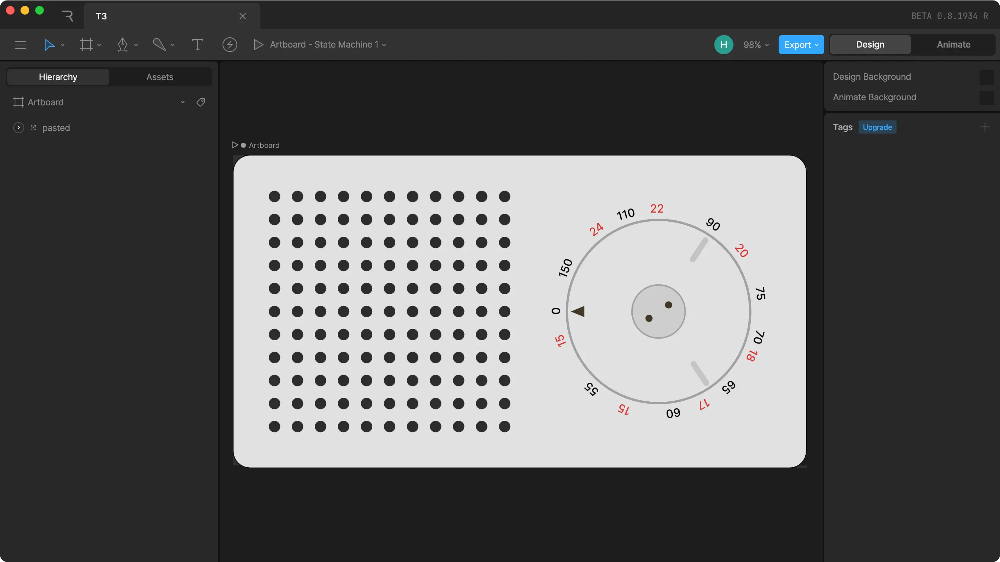
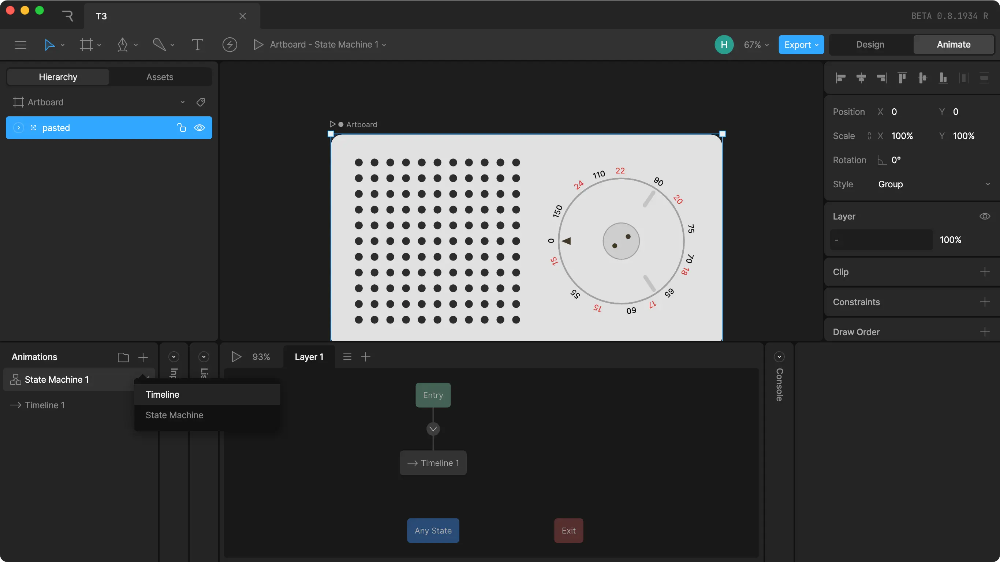
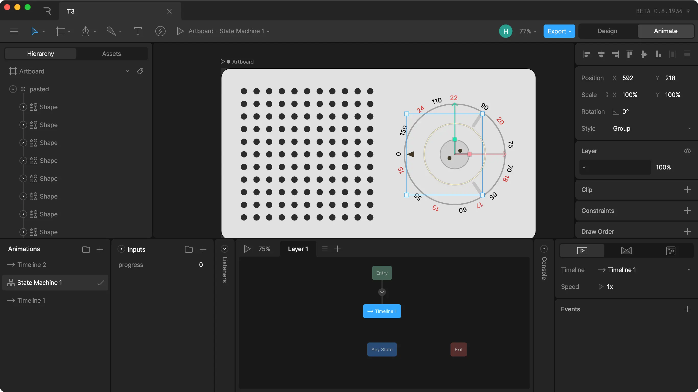
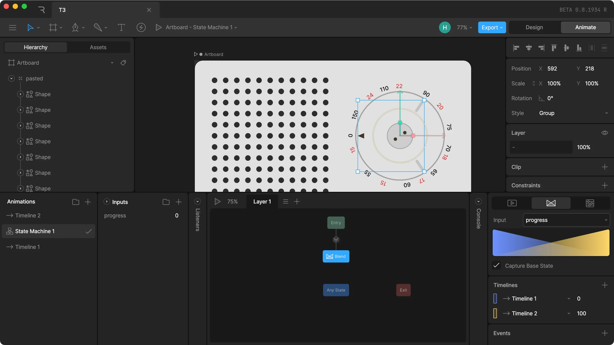

import Aside from './components/Aside';
import RiveScroll from './components/RiveScroll';

<div class="wide" >
<RiveScroll/>
</div>
<br/>
<br/>

Rive is a great tool for embedding animations on a website. I recently wanted to bind the progress of a rive animation to the scroll of a page, kinda like you see above.

The file setup part is almost as important as the code itself, as I haven't found a great way to just use the timeline of a single animation, and instead rely on animation based on an input variable. 


## File Setup

In order to properly animate the rive file in the browser, we need to be able to control it somehow. This is done through the use of variables in the rive file. I'll explain it based on a simple example of a radio with a frequency dial.


<div class="xwide">
<Aside spread="3/2">

  

  <div>
    <h3>1. Create a new Rive file and import your assets</h3>
    <p>You'll need a rive file with some assets you want to animate. I'll use an SVG of an old Braun T3 radio.</p>
  </div>
</Aside>
</div>

<div class="xwide">
<Aside spread="3/2">

  

  <div>
    <h3>2. Create a new Timeline and animate your assets</h3>
    <p>Next, you want to create a new timeline and animate your assets in there. In this example, I've rotated the frequency dial of the radio. You don't need to touch the first timeline, as it will represent the initial state of the animation.</p>
  </div>
</Aside>
</div>

<div class="xwide">
<Aside spread="3/2">

  

  <div>
    <h3>3. Create an input variable</h3>
    <p>To drive the animation, add an input variable. I've named mine 'progress' in this example, but you can name it whatever you want.</p>
  </div>
</Aside>
</div>


<div class="xwide">
<Aside spread="3/2">

  

  <div>
    <h3>4. Select Timeline 1 and set it to "Blend 1D"</h3>
    <p> Select <code>Timeline 1</code> in the state machine and set it to <code>Blend 1D</code> in the bottom right panel. This will allow you to blend between the initial state and the animated state of Timeline 2. In the <code>Timelines</code> section, add both timelines and set one to 100, like shown in the screenshot above.
    </p>
  </div>
</Aside>
</div>


### 5. Try out the animation

If you press play, you should now be able to set the progress of your animation using the input variable you created.

<div class="wide">
  <video
    style={{
      maxWidth: '100%',
    }}
    controls={false} autoplay loop muted playsinline
  >
    <source src="./5.mp4" type="video/mp4"/>
    Your browser does not support the video tag.
  </video>
</div>


## Code

I've originally implemented this in an Astro site, so the code is just regular JS without any framework.

First, you'll need to create a canvas element somewhere. Make sure to match the width and height of the canvas to the artboard size of your rive file.

```html
<!-- index.html  -->
<canvas id="rive-canvas" width="798" height="436"></canvas>
```

Then, we'll create a script which does the following:

1. Load the Rive renderer
2. Create a rive instance for the animation file
3. sync it to the scroll position
4. add a throttled window resize listener to update the canvas resolution without too much lag 

Also, I'm using the canvas-lite version of rive to reduce the file size. When using vite, you'll need to add `?url` to the rive wasm file import. Here's the full code:

<details>
  <summary>Click to show the raw JS code.</summary>


```ts
// index.ts
import riveWASMResource from "@rive-app/canvas-lite/rive.wasm?url";
import {
  Rive,
  StateMachineInput,
  RuntimeLoader,
} from "@rive-app/canvas-lite";

RuntimeLoader.setWasmUrl(riveWASMResource);
let stateMachineLoadInput: StateMachineInput;

const canvas = document.getElementById("rive-canvas");
if (!canvas || !(canvas instanceof HTMLCanvasElement))
  throw new Error("canvas element not found");

// 🚨 make sure to change the artboard and state machine names to match your rive file
const r = new Rive({
  src: "/player.riv",
  canvas: canvas,
  autoplay: true,
  stateMachines: "State Machine 1",
  artboard: "Artboard",

  onLoad: () => {
    stateMachineLoadInput = r.stateMachineInputs("State Machine 1")[0];
    stateMachineLoadInput.value = 0;
    r.resizeDrawingSurfaceToCanvas();
  },
});

// listening to window resize events to resize the canvas,
// without this, the canvas will be blurry when resizing the window
let resizeTimeout: any | null = null;
window.addEventListener(
  "resize",
  () => {
    if (resizeTimeout === null) {
      resizeTimeout = setTimeout(() => {
        r.resizeDrawingSurfaceToCanvas();
        resizeTimeout = null;
      }, 200);
    }
  },
  { passive: true }
);

// this part actually does the scroll syncing. If here you can change
// the window event listener to anything else, for example
// an intersection observer, mouse movement, etc.
window.addEventListener(
  "scroll",
  () => {
    if (!stateMachineLoadInput) return;
    const scrollPercentage =
      (window.scrollY /
        (document.documentElement.scrollHeight - window.innerHeight)) *
      100;

    stateMachineLoadInput.value = scrollPercentage;
  },
  { passive: true }
);
```

</details>

<br/>

You will probably have to change the loading of the rive player to fit your framework / bundler, as well as the rive file import. Also, make sure to check if the state machine and artboard names match the ones in your rive file.

I've also included a React Example: 

<details>
  <summary>Click to show the React component code.</summary>

```ts
import React, { useEffect } from "react";
import { useRef } from "react";
import riveWASMResource from "@rive-app/canvas-lite/rive.wasm";
import { Rive, StateMachineInput, RuntimeLoader } from "@rive-app/canvas-lite";
import riveFile from "./t3.riv";

const RiveScroll = () => {
  const canvasRef = useRef<HTMLCanvasElement>(null);

  useEffect(() => {
    console.log("rive", riveWASMResource);
    RuntimeLoader.setWasmUrl(riveWASMResource);
    let stateMachineLoadInput: StateMachineInput;

    if (!canvasRef.current) throw new Error("canvas element not found");

    // 🚨 make sure to change the artboard and state machine names to match your rive file
    const r = new Rive({
      src: riveFile,
      canvas: canvasRef.current,
      autoplay: true,
      stateMachines: "State Machine 1",
      artboard: "Artboard",

      onLoad: () => {
        stateMachineLoadInput = r.stateMachineInputs("State Machine 1")[0];
        stateMachineLoadInput.value = 0;
        r.resizeDrawingSurfaceToCanvas();
      },
    });

    let resizeTimeout: any | null = null;
    const onResize = () => {
      if (resizeTimeout === null) {
        resizeTimeout = setTimeout(() => {
          r.resizeDrawingSurfaceToCanvas();
          resizeTimeout = null;
        }, 200);
      }
    };
    window.addEventListener("resize", onResize, { passive: true });

    const onScroll = () => {
      if (!stateMachineLoadInput) return;
      const scrollPercentage = (window.scrollY / window.innerHeight) * 100;
      stateMachineLoadInput.value = scrollPercentage;
    };
    window.addEventListener("scroll", onScroll, { passive: true });

    return () => {
      window.removeEventListener("resize", onResize);
      window.removeEventListener("scroll", onScroll);
    };
  }, [canvasRef.current]);

  return (
    <div>
      <canvas
        style={{
          width: "100%",
        }}
        ref={canvasRef}
        id="rive-canvas"
        width="798"
        height="436"
      />
    </div>
  );
};

export default RiveScroll;

```

</details>

<br/>

Again, importing the rive wasm and .riv file depends on your bundler, e.g. for webpack you might need to change your config to load the wasm file using the `file-loader`.

That's it! You should now have a working scroll-linked animation using Rive. Thanks for reading, I hope this was helpful!

<style>
  {`
  .wide img {
    box-shadow: none!important;
  }


  code:not(.language-html) {
    color: #121212;
    background-color: #fff;
    padding-inline: 0.2rem;
    border-radius: 2px;
    font-size: 1.1rem;
    white-space: nowrap;
  }
  
  .xwide {
    max-width: 1200px!important
  }

  `}
</style>


